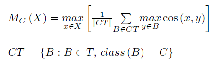

# Fuzzy-Rough Classifiers
Framework for developing fuzzy and fuzzy-rough algorithms for multiple-instance classification problems

The framework facilitates the design of multiple-instance classification algorithms that are based on fuzzy-sets and rough-sets. In contrasts with regular classification problems, in which each example has a unique description, in multiple-instance classification (MIC) problems, each example has many descriptions. In MIC, each example is called <em>bag</em>, and each description of a bag is an <em>instance</em>. In fuzzy multi-instance classifiers, each class is regarded as a fuzzy set to which every bag has a degree of membership. When classifying an unseen bag, the classifiers calculate its membership degree to each class and assign it to the class for which this value is largest. In the framework we define java classes for each mathematical concept involved in the calculus of class memberships:

- similarity and distance functions between instances
- similarity and distance functions between bags
- numeric operators for two or more operands (ex., addition, multiplication, maximun, average)
- fuzzy operators (implicators, TNorms)
- aggregators that iterate over, for example, all instances in a bag, or a set of bags, applying a numerical operation on them
- weighting schemes for weighted average aggregation
- bag membership and class membership functions
- variables

Usage example:

Lets consider the membership function M of a sample bag X to the class C:

T is the set of all training bags; and CT is the set of training bags belonging to class C.

Using the framework, you first need to declare the variables involve in the mathematical expression. Then, you define the membership function relying on the framework's classes:
<pre><code>
  Var <Integer>  C = new Var();   // target class label  
  Var <Instance> X = new Var();   // bag with unknown label 
  Var <Instance> B = new Var();   // a bag  
  Var <Instance> x = new Var();   // an instance 
  Var <Instance> y = new Var();   // another instance 
  Var <Instances> T = new Var(); // the training samples
  
  setMembership(new MembershipToClass(X, T, C, 
            new Max(new InstancesFromBag(x, X), 
            new Average(new BagsFromClass(B, T, C),
            new Max(new InstancesFromBag(y, B),
            new CosineSimilarity(x, y))))));
</code></pre>
